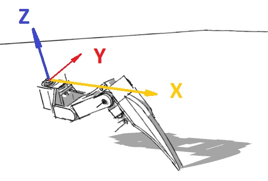
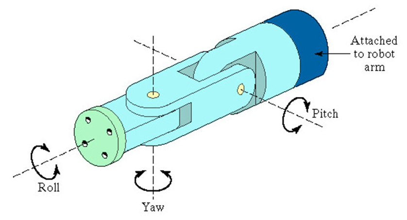

# Inverse Kinematics

## Introduction

Kinematics is the study of motion without considering the cause of such motion. such as forces and torques.
As opposed to forward kinematics, which computes the desired arrival coordinates of a robot given joint configuration as input, inverse kinematics (IK) is essentially the reverse operation, that is, computing joint configuration(s) to reach a desired arrival coordinate.
(**TLDR**: inverse kinematics is where you input where you want to go, and get the joint positions of how your robot needs to move in order to arrive at that position as output)

## Requirements

In order to compute the inverse kinematics of our BeetleBot, we will need the lengths of the joint sections, as well as some basic mechanical physics computations (into which we will input the joint lengths).

(The axis of the sketches are not indicative, they are only to visually show the different leg lengths)

<figure>
    

        
        
    

    <figcaption> Figure 1: Leg Labels (left) and Figure 2: Leg Axis (right) </figcaption>
</figure>

## Calculations

There are various online resources that have already done the brunt work of the mathematical and physics calculations that are needed in order to compute the inverse kinematics of walking robots. (I invite you to read up on the links in the sources for more precise details on the equations).
The [following](https://docs.google.com/spreadsheets/d/1CeIF2OFrUGDsMMskBs049kWXuV0JkgUp/edit?usp=sharing&ouid=116668604227116958658&rtpof=true&sd=true), (explanation [here](https://toglefritz.com/hexapod-inverse-kinematics-simulator/)) is a spreadsheet made to calculate all the required servo angles in order to have a basic translational walking gait. (Additional calculations will be needed in order to have different gaits, such as yaw, pitch, and roll, as illustrated via Figure 3.)

<figure>
    
    <figcaption> Figure 3: Arm Gait Axis</figcaption>
</figure>

## Desired Movements

To achieve versatile and efficient movement, our hexapod robot should be capable of performing the following movements:
- Translational movement
  - Forward and Backward walking
  - Sideways walking (crab walk)
- Turning (Yaw)
- Pitch and Roll Adjustments

## Sources

- <https://toglefritz.com/hexapod-inverse-kinematics-equations/>
- <https://oscarliang.com/inverse-kinematics-and-trigonometry-basics/>
- <https://motion.cs.illinois.edu/RoboticSystems/InverseKinematics.html>
