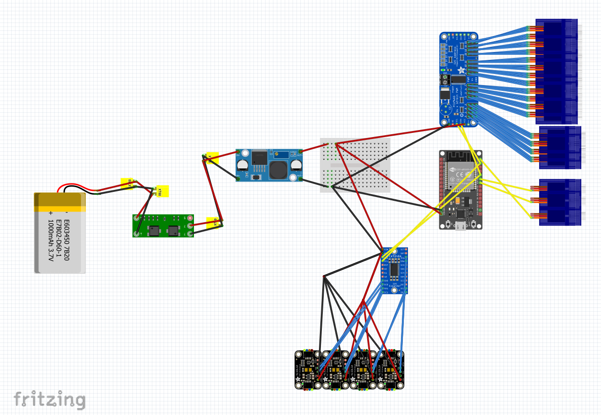

<h1 align="center">CS-358 Project: BeetleBot 🪲</h1>

---

**Contributors:** Anna Barberis, Omayma Hadiji, Adèle Monjauze, Jonas Zimmermann, Anas El Madhi

## Project Description

BeetleBot is a six-legged robot with 3 degrees of freedom on each leg. The idea is to mimic the walking pattern of an insect, or more specifically to implement a tripod-like motion. Walking on flat ground, a hexapod can implement many different gaits to move itself. The most popular ones include tripod gait, going forward, backward, and rotating, an crab walk-like motion. 
Thus, a hexapod demonstrates flexibility in how it can move and balance its weight. Our robot moves itself based on an input given by a user through a web application. 
It interacts with its surrounding with three sensors posted on the front and the side. Read more on the [project proposal]().

## Table of Contents
- [Hardware & Design Specifications](#hardware-and-design-specifications)
- [Software Specifications](#software-specifications)
- [Challenges](#challenges)
- [Installation Requirements](#installation-requirements)
- [Make your own BeetleBot](#make-your-own-beetleBot)
- [Pinouts](#pinouts)
- [Usage Instructions](#usage-instructions)
- [Troubleshooting](#troubleshooting)
- [Acknowledgments](#acknowledgments)

## Hardware And Design Specifications

[View 3D Model](documentation/full_bot.stl)

The goal of our 3D design was to keep it lightweight, as compact as possible, and avoid any unnecessary plastic. This led to minimalistic legs with sturdy joints, using just enough material to hold the servos tightly, all while eliminating unwanted movement and making sure the servos weren’t supporting their own weight. The legs were also made in such a way that they could fold on themselves and go the most downwards possible. Indeed, the more the legs aligned under the body, the less force the servos would require to hold the whole hexapod. Standing up with your legs far apart is much harder than standing up with your legs close together. Being able to fold on themselves is a very important aspect that was needed when the hexapod was standing up: for example, if you come out of a swimming pool with your arms far from your body, you will have a hard time getting up, while if theyre are close to it, it will be much easier.

The base was designed to support the heaviest items on the bottom for better stability, while the lid holds the materials that require the most convenient access. This resulted in having 6 servos and the battery, along with its protection board and the buck converter, on the bottom as they hold the most weight. The ESP32 and the servo multiplexer were placed on top as we often needed to change the ESP's or the multiplexer's cabling. The 6 servos that served as coxas were placed downwards and on the base so they wouldnt require any unecessary additional structure by being directly screwed on the floor of the base.
Finally, the base was designed with many holes to lighten it.

The final weight of the hexapod is 495g with an approximate size of 11 * 8.5 * 8 cm³ without the legs and 11 * 35 * 15 cm³ with the legs spread apart for the width of 35 cm and with the legs at their lowest for the height of 15cm.

## Software Specifications
The robot is capable of rotational, directional movements as well as standing / sitting (pose transitions). The implementation of those gait patterns works alongside real-time feedback from 3 VL53L1X sensors. The robot is controlled remotely through a webserial, or through input on a terminal (serial monitor) when plugged-in. 
The webpage accepts directional commands (North, East...) with additional curve orientations (North east, North West). The user can choose to toggle, on the webpage, between translational or rotational movement, and can also choose to toggle on sensor detection. If the sensor detection is on, the cycle of movement will stop if an object is in front, or on the sides, at a given distance. 
Each of our gaits are pre-defined. Real-time interpolation of those pre-defined angles is computed so that each leg moves smoothly, ie a leg contains three servos, and synchronizes with the whole 18 servos. 

The webpage and all of its content is loaded on the flash memory with SPIFFS, which makes it last between resets and not sent when uploading code. The website is processed in main.cpp, which changes the IP address of the websocket defined in it. This websocket is used to send updates between the control panel and the ESP. This is how the ESP get the last input and how the web page get the sensors' distances (used to update animations). The website takes input with a keyboard or with the joystick shown on screen. Both methods send the exact same data to the ESP, to simplify how it is handled.

## Challenges

- Hardware:
    - The challenges for the CAD was mainly the leg: We initially had a first design where the leg was unecessary long and heavy, with an added effect of the servos having to handle their own weight along with the rest of the leg. We did not realise immediately the importance of the design, thinking the servos would be able to hold it in any case. In fact, even with our now optimised design, they still struggle carrying the whole weight. The leg being too long was also problematic because this made it impossible for the hexapod to stand up or walk without putting too much force on the servos. It took some time but we finally managed to create a minimalistric design where the servos were tightly screwed to their joint. In consequence, the legs were much lighter and the servos did not have to hold their own weight anymore.
    - Another hardware challenge was the cable management. Indeed, we were facing a trio of cables for each servos, along with cables for the multiplexer, the battery, the sensors and the ESP32, totalling with a strong ~50 cables. We managed to make some of them fit inside the base, but the biggest problems was the cables that had to stay outside of the base since the multiplexer was on the lid. We ended up tying the servo cables together so they would not be everywhere around our hexapod.  
- Software:
    - One of the main challenges was trying to implement inverse kinematics (IK). While the math behind it was well-understood on paper, translating it to code was a bit more compilcated. The IK computations relied heavily on real-world measurements, such as the exact lengths of the leg segments and the position of the servos, and small differences made the leg movement inaccurate or unexpected. Tuning those parameters was particularly difficult, and we were short on time to completely dive in and properly understand what was wrong and how to fix it. We made compromises by gradually introducing motion interpolation and hardcoding the gaits we wanted, as explained on the last section.
    - Another challenge we faced was implementing an interface to control the bot over WiFi. This has been done with multiple libraries that are listed in our platformio.ini. The most notable are the webserver and the websocket: The first just sends a file when a GET request arrive, while the second is set between the webapp and the ESP to exchange information during execution. The webapp sends the input the bot must follow, while the ESP sends the distances recorded by sensors. This task didn't create as much trouble for us as other ones, but it required a lot of background knowledge for the different APIs and how everything needed to be connected.

## Installation Requirements

- Hardware requirements (e.g., components needed).
    - Electronics:
        - 18 servos (in our case it was servo SG90 but we would heavily recommand stronger ones)
        - 3 sensors(TOF400C) to place in front and on the sides
        - PCA 9685 PWM multiplexer to plug the servos (would advise to have two multiplexers instead of just one)
        - Esp32 Devkit V1 Board as a micro controller, or any esp32 that has WiFi
        - LiPo Battery 25C 1000mAh 2S
        - Protection Board for the battery (2 cell BMS)
        - Jst connectors to connect the protection board and the battery
        - LM2596 Buck Converter
        - Cables and tape for the cable management (very important)
    - CAD components:
        - a base to hold the battery, 6 servos that will serve as the Coxas of the legs.
        - a lid to screw on top of the base, where we can place the multiplexer, the ESP32 and the buck converter.
        - 3 sensor holders to place in between the base and the lid
        - 6 legs composed of 3 pieces each:
            - a first joint to link the Coxa and the Femur
            - a second joint to link the Femur and the Tibia
            - a toe with a TCP tip
- Software requirements: Open the code folder inside VSCode, and install the PlatformIo Extension.
    - Platformio will automatically update itself with the library in platformio.ini, so the one we already wrote can be used directly.
    - To use the robot:
        - Go to the platformIO tab on VSCode, then go to your board > "Build Filesystem Image". After this is finished, use "Upload Filesystem Image". This will send the data folder, containing the website, to the ESP's flash memory.
        - Upload the code to the ESP.

  
## Make your own BeetleBot:
- Print all the 3D parts inside this [folder](CAD)
- Soldering :
    - solder the protection board : 2-jst female connector to the 8.4V for the (+) and 0V for the (-) : This will be where you plug your battery.
    - Solder the protection board 2 : thick cables on 12.6V for the (+) and 4.2V for the (-) : This will be for the consumer side.
    - Solder the thick cables to the buck converter
    - Solder some cables (preferably thick) from the out pins of the buck converter and connect it to the general (+) and (-) circuit of your system.
- Screw on the 18 servos to the main body and on their joints: make sure to set them to a given angle (setAngle) inside data.h and put them on at a right angle to their joints
- Place the buck converter, the battery, the protection board, and the bundle of cables inside the body and screw on the lid on top
- Screw the multiplexer on the lid.
- Place the ESP32 in its sloth and crew the T stick figure on top to keep it in place.
- Plug in all the servos on the multiplexer according to the mapping in the data.h, two of those servos (in our case the tibias of the two front legs) should be plugged in to the esp and powered from the power supply.
- Plug all the cables coming out of the multiplexer (SDA, SCL,...)
- Plug in the sensors on the esp, and screw them (or tape them).
- Finally, you can place a little hat on top and you're good to go!

## Pinouts
On Esp:
  - two servos PMW are plugged in on pin 18 and 23 of the ESP
  - SDA (pin 21) plugged to the multiplexer, and the sensors.
  - SCL (pin 22) plugged to the multiplexer, and the sensors.
  - 5V pin to power the esp
  - GND pin from the esp to the power supply

On the multiplexer:
  - Connect the power's (-) to the (-) of the multiplexer
  - Same for the (+)

For the sensors:
  - plug their SDA to the general SDA circuit
  - plug their SCL to the general SCL circuit
  - plug their (+) to the general (+) circuit
  - plug their (-) to the general (-) circuit

For the servos: plug them all on the multiplexer

Here is a picture of the circuit for additionnal help. Please note that for the cables that use the breadboard, this means you need to solder them together or clips them together :

        
## Usage Instructions

Explain how to use your project. Include:
- Go on the wifi_credentials.h file
- Input the name of the wifi you will share with your ESP32 (You must both be on the same wifi)
- Put your wifi password
- Upload the code on the ESP32
- It will give you an IP adress: Copy paste it on your browser
- You will now be on the Web App: 
    - You can use the joystick to move around
    - You have different movement categories that you may change with the button 'change movement type'
    - Wether you are on AZERTY or QWERTZ, you can use THE WASD / ZQSD to move
- Have fun!

## Troubleshooting

There might be issues connecting to the ESP32 sometimes, it could be a port issue, if that is the case just look up and download 'CH340 driver'

## Acknowledgments

We thank the assistants for their help, and we also thank Mehdi A. who was not our assistant but still helped us a lot <3